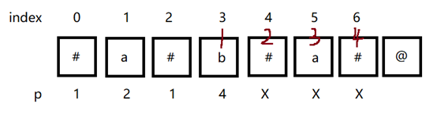

### 题目

给你一个字符串 `s`，找到 `s` 中最长的回文子串。

如果字符串的反序与原始字符串相同，则该字符串称为回文字符串。


**示例 1：**

```
输入：s = "babad"
输出："bab"
解释："aba" 同样是符合题意的答案。
```

**示例 2：**

```
输入：s = "cbbd"
输出："bb"
``` 

**提示：**

- `1 <= s.length <= 1000`
- `s 仅由数字和英文字母组成`

### 代码

**中心扩散**

```python
class Solution:
    def longestPalindrome(self, s: str) -> str:
        n = len(s)
        res = ''

        def helper(l, r):
            nonlocal res
            while l >= 0 and r < n and s[l] == s[r]:
                l -= 1
                r += 1
            if len(res) < r - l - 1:
                res = s[l+1:r]

        for i in range(n-1):
            helper(i, i)
            helper(i, i+1)
        return res
```

**manacher算法**

```python
class Solution:
    def longestPalindrome(self, s: str) -> str:
        tem = '$#' + '#'.join(list(s)) + '#&'
        n = len(tem)
        max_right = 0
        max_mid_index = 0
        p = [0] * n
        for i in range(1, n-1):
            if i > max_right:
                while tem[i-p[i]] == tem[i+p[i]]:
                    p[i] += 1
                max_right = i + p[i] - 1
                max_mid_index = i
            else:
                p[i] = p[2*max_mid_index - i]
                if i + p[i] - 1 > max_right:
                    p[i] = max_right - i + 1
                while tem[i-p[i]] == tem[i+p[i]]:
                    p[i] += 1
                if i + p[i] - 1 > max_right:
                    max_right = i + p[i] - 1
                    max_mid_index = i
        index = p.index(max(p))
        return tem[index - p[index] + 1: index + p[index]].replace('#', '')
```

### 题解

#### 中心扩散

分为奇偶分别扩散一次求得结果

#### manacher算法

**字符的处理**

在每个字符和字符串开头与结尾都添加上特殊符号`"#"`。然后在两端分别加入一个全新的符号，这样可以省去边界的判断。如`"aba"`可以改写成`"@#a#b#a#$"`。

 

**几个重要变量的初始化**

建立列表`p`，并给其添加和字符串等数量的`0`，之后会用来记录每个元素向两边扩散所能达到的最大回文长度。

将`max_right`，`max_mid_index`初始化为`0`，前者用来记录已经观测到的所有回文串中右边界所能到达的最远的地方，后者则是这个回文串的对称点索引值。

 

**主体循环**
利用索引值进入循环`（for i in range(1,len(s) - 1)）`。

此时分三种情况：

1. 第一种：
    当`i > max_right`时，说明我们没法利用前面已知的数据来判断当前索引值下的元素扩散情况，因此我们让其向两边扩散查找最长回文串即可。查找完后这个回文串的右边界索引值必定大于`max_right`，故令`max_right = i+p[i]-1`。相应地，`max_mid_index = i`

2. 第二种：
    当`i <= max_right`时，根据回文串的对称性，可以令`p[i]`直接等于`p[2*max_mid_index - i]`，然后在此基础上继续向两边扩散看看能不能找到更长的回文串。

    比如说，我们有`"#a#b#a#"`这个字符串，现在我们已经找到`p[3] = 4`（表示以b为中点的最长回文串可以由中心点向右延伸四位），因此此时`max_right = 6`,`max_mid_index = 3`。

    


    由回文串的对称性可知，回文串的前一部分和后一部分肯定是相反的，不然也不会称之为回文串。因此，`p[4]`可以直接等于`p[2]`。同理，`p[5] = p[1] = 2`，然后继续向两边扩散查看后面能否继续构成回文串。

 

3. 第三种
    `i <= max_right`，但是与`p[i]`对称的`p[2*max_mid_index - i]`超出了超出了右边界的范围，此时无论`p[2*max_mid_index - i]`的值多大，`p[i]`都要等与`max_right – i + 1`。例如以下字符串：

    

 

    已经确定了`p[5] = 4`，右边界此时为`8`。于是轻松算的`p[6]`为`1`，但是若还是之前的逻辑，`p[7]`应该直接等于`4`了，这明显与理性的判断不符，原因在于此时"V"的索引值`7+p[3] = 11`已经超出边界了，超出的这一部分我们前面还没有接触过，并不知道是否为回文串，故只能先令`p[7] = 右边界的索引值 – 索引值 + 1 = 2`，然后继续判断`s[9]`是否等于`s[5]`，若等于，继续判断，并在判断结束后修改`max_right`,`max_mid_index`的值；若不等，则此时的`p`值确定。
