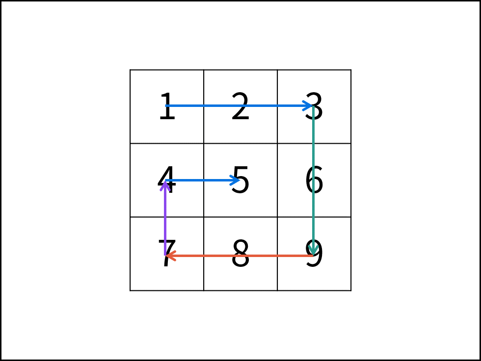

### 题目

给你一个 `m` 行 `n` 列的矩阵 `matrix` ，请按照 `顺时针螺旋顺序` ，返回矩阵中的所有元素。

**示例 1：**


```
输入：matrix = [[1,2,3],[4,5,6],[7,8,9]]
输出：[1,2,3,6,9,8,7,4,5]
```

**示例 2：**


```
输入：matrix = [[1,2,3,4],[5,6,7,8],[9,10,11,12]]
输出：[1,2,3,4,8,12,11,10,9,5,6,7]
``` 

**提示：**

- `m == matrix.length`
- `n == matrix[i].length`
- `1 <= m, n <= 10`
- `-100 <= matrix[i][j] <= 100`

### 代码

```python
class Solution:
    def spiralOrder(self, matrix: List[List[int]]) -> List[int]:
        if not matrix:
            return []
        res = []
        # 上下左右边界
        l, r, t, b = 0, len(matrix[0])-1, 0, len(matrix)-1
        while True:
            # 从左往右打印上边界所在的行
            for i in range(l, r+1):
                res.append(matrix[t][i])
            # 上边界加1
            t += 1
            # 如果上边界超过下边界循环终止
            if t > b:
                break
            # 从上往下打印右边界所在的列
            for i in range(t, b+1):
                res.append(matrix[i][r])
            # 右边界减1
            r -= 1
            # 如果左边界超过右边界循环终止
            if l > r:
                break
            # 从右往左打印下边界所在的行
            for i in range(l, r+1)[::-1]:
                res.append(matrix[b][i])
            # 下边界减1
            b -= 1
            # 如果上边界超过下边界循环终止
            if t > b:
                break
            # 从下往上打印左边界所在的列
            for i in range(t, b+1)[::-1]:
                res.append(matrix[i][l])
            # 左边界加1
            l += 1
            # 如果左边界超过右边界循环终止
            if l > r:
                break
        return res
```

### 题解

根据题目示例 `matrix = [[1,2,3],[4,5,6],[7,8,9]]` 的对应输出 `[1,2,3,6,9,8,7,4,5]` 可以发现，顺时针打印矩阵的顺序是 “从左向右、从上向下、从右向左、从下向上” 循环。

因此，考虑设定矩阵的 “左、上、右、下” 四个边界，模拟以上矩阵遍历顺序。



**算法流程：**

1. 空值处理： 当 `matrix` 为空时，直接返回空列表 `[]` 即可。
2. 初始化： 矩阵 左、右、上、下 四个边界 `l` , `r` , `t` , `b` ，用于打印的结果列表 `res` 。
3. 循环打印： “从左向右、从上向下、从右向左、从下向上” 四个方向循环打印。
    - 根据边界打印，即将元素按顺序添加至列表 `res` 尾部。
    - 边界向内收缩 `1` （代表已被打印）。
    - 判断边界是否相遇（是否打印完毕），若打印完毕则跳出。
4. 返回值： 返回 `res` 即可。

| 打印方向 | 1.根据边界打印 | 2.边界向内收缩 | 3.是否打印完毕 |
|--|--|--|--|
| 从左向右 | 左边界`l`，右边界`r` | 上边界`t`加`1` | 是否`t>b` |
| 从上到下 | 上边界`t`，下边界`b` | 右边界`r`减`1` | 是否`l>r` |
| 从右到左 | 右边界`r`，左边界`l` | 下边界`b`减`1` | 是否`t>b` |
| 从下到上 | 下边界`b`，上边界`t` | 左边界`l`加`1` | 是否`l>r` |


[题解链接](https://leetcode.cn/problems/spiral-matrix/solutions/2362055/54-luo-xuan-ju-zhen-mo-ni-qing-xi-tu-jie-juvi/)
