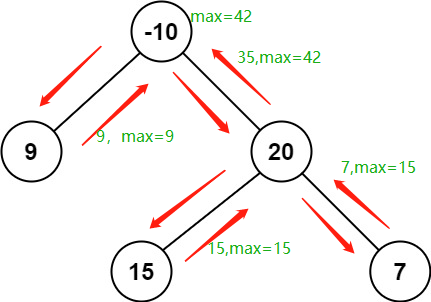

### 题目

二叉树中的 `路径` 被定义为一条节点序列，序列中每对相邻节点之间都存在一条边。同一个节点在一条路径序列中 `至多出现一次` 。该路径 `至少包含一个` 节点，且不一定经过根节点。

`路径和` 是路径中各节点值的总和。

给你一个二叉树的根节点 `root` ，返回其 `最大路径和` 。

 
**示例 1：**


```
输入：root = [1,2,3]
输出：6
解释：最优路径是 2 -> 1 -> 3 ，路径和为 2 + 1 + 3 = 6
```

**示例 2：**


```
输入：root = [-10,9,20,null,null,15,7]
输出：42
解释：最优路径是 15 -> 20 -> 7 ，路径和为 15 + 20 + 7 = 42
``` 

**提示：**

- 树中节点数目范围是 `[1, 3 * 104]`
- `-1000 <= Node.val <= 1000`

### 代码

```python
# Definition for a binary tree node.
# class TreeNode:
#     def __init__(self, val=0, left=None, right=None):
#         self.val = val
#         self.left = left
#         self.right = right
class Solution:
    def maxPathSum(self, root: Optional[TreeNode]) -> int:
        max_value = root.val

        def dfs(root):
            nonlocal max_value
            # 递归终止条件：递归到空节点返回0
            if not root:
                return 0
            # 左子树贡献为 0和递归左子树返回的最大值
            left = max(0, dfs(root.left))
            # 右子树贡献为 0和递归右子树返回的最大值
            right = max(0, dfs(root.right))
            # 更新最大值看是否为根节点值加左右子树贡献值
            max_value = max(max_value, root.val + left + right)
            # 只能返回根节点+左右子树较大值，因为不能有分叉
            return root.val + max(left, right)
        
        dfs(root)
        return max_value
```

### 题解

**DFS**

1. 初始化最大值为 `root.val`
2. 递归调用直至叶子结点
3. 空节点返回 `0` ，最大值更新为 `max(max_value, root.val + left + right)`
4. 返回 `root.val + max(left, right)`

