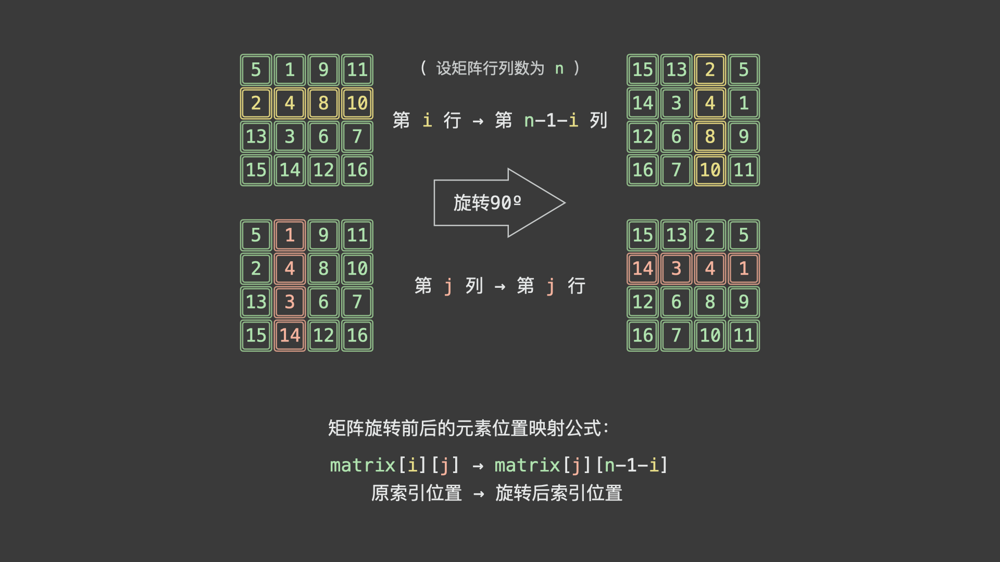

### 题目

给定一个 `n × n` 的二维矩阵 `matrix` 表示一个图像。请你将图像顺时针旋转 `90` 度。

你必须在 `原地` 旋转图像，这意味着你需要直接修改输入的二维矩阵。请不要 使用另一个矩阵来旋转图像。


**示例 1：**


```
输入：matrix = [[1,2,3],[4,5,6],[7,8,9]]
输出：[[7,4,1],[8,5,2],[9,6,3]]
```

**示例 2：**


```
输入：matrix = [[5,1,9,11],[2,4,8,10],[13,3,6,7],[15,14,12,16]]
输出：[[15,13,2,5],[14,3,4,1],[12,6,8,9],[16,7,10,11]]
```

**提示：**

- `n == matrix.length == matrix[i].length`
- `1 <= n <= 20`
- `-1000 <= matrix[i][j] <= 1000`

### 代码

```python
class Solution:
    def rotate(self, matrix: List[List[int]]) -> None:
        """
        Do not return anything, modify matrix in-place instead.
        """
        n = len(matrix)
        # 行数只需要遍历一半
        for i in range(n//2):
            # 列数需要遍历一半向上取整，例如3x3的矩阵需要将1x2的左上角部分旋转，4x4的矩阵需要将2x2的左上角部分旋转
            for j in range((n+1)//2):
                # 暂存左上角部分的值
                tmp = matrix[i][j]
                # 依次赋值
                matrix[i][j] = matrix[n-1-j][i]
                matrix[n-1-j][i] = matrix[n-1-i][n-1-j]
                matrix[n-1-i][n-1-j] = matrix[j][n-1-i]
                matrix[j][n-1-i] = tmp
```

### 题解

