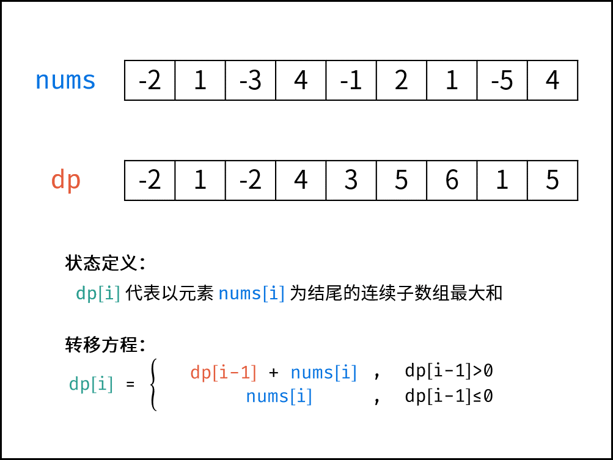

### 题目

给你一个整数数组 `nums` ，请你找出一个具有最大和的连续子数组（子数组最少包含一个元素），返回其最大和。

子数组 是数组中的一个连续部分。

**示例 1：**

```
输入：nums = [-2,1,-3,4,-1,2,1,-5,4]
输出：6
解释：连续子数组 [4,-1,2,1] 的和最大，为 6 。
```

**示例 2：**

```
输入：nums = [1]
输出：1
```

**示例 3：**

```
输入：nums = [5,4,-1,7,8]
输出：23
``` 

**提示：**

- `1 <= nums.length <= 105`
- `-104 <= nums[i] <= 104`

### 代码

```python
class Solution:
    def maxSubArray(self, nums: List[int]) -> int:
        # 获取列表长度
        n = len(nums)
        # 从第二个元素开始
        for i in range(1, n):
            # 更新当前元素值为 当前值 + 前一元素值与0的最大值
            nums[i] += max(nums[i-1], 0)
        # 返回原地修改后列表的最大值
        return max(nums)
```

### 题解

**动态规划解析：**
- 状态定义： 设动态规划列表 `dp` ，`dp[i]` 代表以元素 `nums[i]` 为结尾的连续子数组最大和。

    - 为何定义最大和 `dp[i]` 中必须包含元素 `nums[i]` ：保证 `dp[i]` 递推到 `dp[i+1]` 的正确性；如果不包含 `nums[i]` ，递推时则不满足题目的 连续子数组 要求。
- 转移方程： 若 `dp[i−1]≤0` ，说明 `dp[i−1]` 对 `dp[i]` 产生负贡献，即 `dp[i−1]+nums[i]` 还不如 `nums[i]` 本身大。

$$
dp[i]=
\begin{cases}
dp[i-1]+nums[i], dp[i-1]>0\\
nums[i], dp[i-1]\leq0\\
\end{cases}
$$
 
- 初始状态： `dp[0]=nums[0]`，即以 `nums[0]` 结尾的连续子数组最大和为 `nums[0]`。

- 返回值： 返回 `dp` 列表中的最大值，代表全局最大值。



**状态压缩：**
- 由于 `dp[i]` 只与 `dp[i−1]` 和 `nums[i]` 有关系，因此可以将原数组 `nums` 用作 `dp` 列表，即直接在 `nums` 上修改即可。
- 由于省去 `dp` 列表使用的额外空间，因此空间复杂度从 `O(N)` 降至 `O(1)`。
- 时间复杂度` O(N)` ： 线性遍历数组 `nums` 即可获得结果，使用 `O(N)` 时间。


[题解链接](https://leetcode.cn/problems/maximum-subarray/solutions/2361770/53-zui-da-zi-shu-zu-he-dong-tai-gui-hua-bvkq9/)
