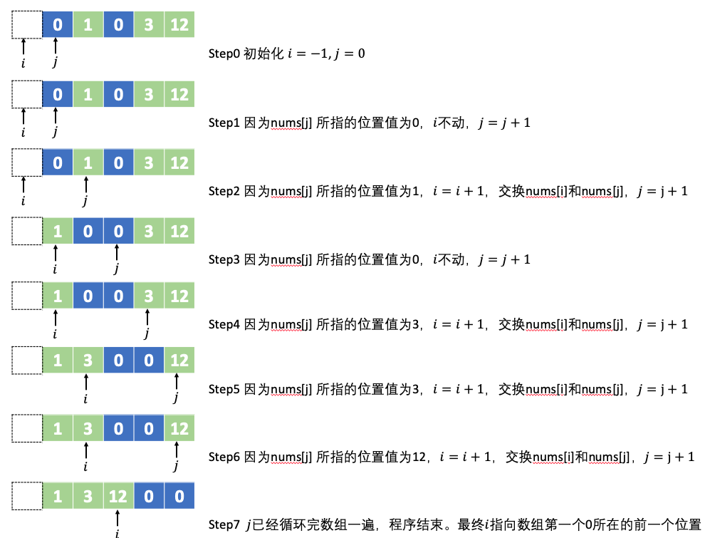

### 题目

给定一个数组 `nums`，编写一个函数将所有 `0` 移动到数组的末尾，同时保持非零元素的相对顺序。

请注意 ，必须在不复制数组的情况下原地对数组进行操作。

**示例 1:**

```
输入: nums = [0,1,0,3,12]
输出: [1,3,12,0,0]
```

**示例 2:**

```
输入: nums = [0]
输出: [0]
``` 

**提示:**

- `1 <= nums.length <= 104`
- `-231 <= nums[i] <= 231 - 1`

### 代码

```python
class Solution:
    def moveZeroes(self, nums: List[int]) -> None:
        """
        Do not return anything, modify nums in-place instead.
        """
        i = -1
        for j in range(len(nums)):
            if nums[j]:
                i += 1
                nums[i], nums[j] = nums[j], nums[i]
```

### 题解

