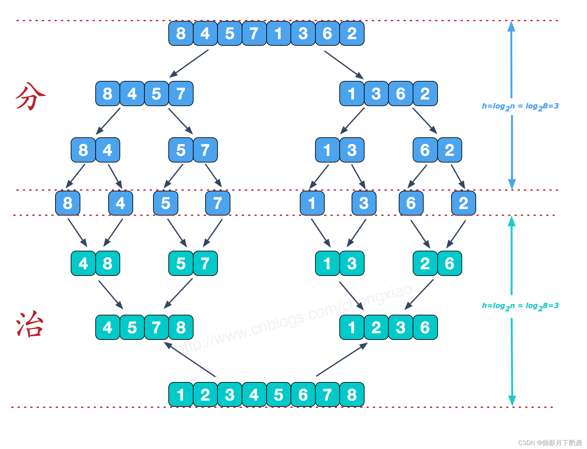

**1.排序算法概述**
```
非线性时间比较类排序：通过比较来决定元素间的相对次序，由于其时间复杂度不能突破O(nlogn)，因此称为非线性时间比较类排序。

线性时间非比较类排序：不通过比较来决定元素间的相对次序，它可以突破基于比较排序的时间下界，以线性时间运行，因此称为线性时间非比较类排序。
```

```
常见的快速排序、归并排序、堆排序以及冒泡排序等都属于比较类排序算法。 比较类排序是通过比较来决定元素间的相对次序，由于其时间复杂度不能突破 O(nlogn)，因此也称为非线性时间比较类排序。在冒泡排序之类的排序中，问题规模为 n，又因为需要比较 n 次，所以平均时间复杂度为 O(n²)。在归并排序、快速排序之类的排序中，问题规模通过分治法消减为 logn 次，所以时间复杂度平均 O(nlogn)。
```

比较类排序的优势是，适用于各种规模的数据，也不在乎数据的分布，都能进行排序。可以说，比较排序适用于一切需要排序的情况。

```
计数排序、基数排序、桶排序则属于非比较类排序算法。 非比较排序不通过比较来决定元素间的相对次序，而是通过确定每个元素之前，应该有多少个元素来排序。由于它可以突破基于比较排序的时间下界，以线性时间运行，因此称为线性时间非比较类排序。
非比较排序只要确定每个元素之前的已有的元素个数即可，所有一次遍历即可解决。算法时间复杂度 O(n)。

```
非比较排序时间复杂度低，但由于非比较排序需要占用空间来确定唯一位置。所以对数据规模和数据分布有一定的要求。


**2.冒泡排序(Bubble Sort)**

***2.1 算法概述***
冒泡排序是一种简单的排序算法。

它重复地遍历待排序的序列，依次比较两个元素，如果它们的顺序错误就把它们交换过来。遍历序列的工作是重复地进行直到没有再需要交换为止，此时说明该序列已经排序完成。这个算法的名字由来是因为越小的元素会经由交换慢慢 “浮” 到数列的顶端。

***2.2 算法步骤***
比较相邻的元素。如果第一个比第二个大，就交换它们两个；

对每一对相邻元素进行同样的工作，从开始第一对到结尾的最后一对，这样在最后的元素应该会是最大的数；

针对所有的元素重复以上的步骤，除了最后一个；

重复步骤 1~3，直到排序完成。


***2.3 代码***
```python
# 时间复杂度:最好:O(n) 平均:O(n²) 最差:O(n²)
# 空间复杂度:O(1)
# 稳定性:稳定
def bubble_sort(self, nums: List[int]) -> List[int]:
	# 遍历len(nums)-1趟
	for i in range(len(nums)):
		is_sorted = True
		# 已经排序好的部分不用排序
		for j in range(len(nums) - i - 1):
			if nums[j] > nums[j + 1]:
				nums[j], nums[j + 1] = nums[j + 1], nums[j]
				is_sorted = False
		if is_sorted:
			break
	return nums

```
**3.快速排序(Quick Sort)**
***3.1 算法概述***
快速排序的基本思想：通过一趟排序将待排序列分隔成独立的两部分，其中一部分记录的元素均比另一部分的元素小，则可分别对这两部分子序列继续进行排序，以达到整个序列有序。

***3.2 算法步骤***
快速排序使用分治法（Divide and conquer）策略来把一个序列分为较小和较大的 2 个子序列，然后递归地排序两个子序列。具体算法描述如下：

从序列中随机挑出一个元素，做为 “基准”(pivot)；

重新排列序列，将所有比基准值小的元素摆放在基准前面，所有比基准值大的摆在基准的后面(相同的数可以到任一边)。在这个操作结束之后，该基准就处于数列的中间位置。(分区操作)

递归地把小于基准值元素的子序列和大于基准值元素的子序列进行快速排序。


***3.3 代码***
```python
# 时间复杂度:最好:O(nlogn) 平均:O(nlogn) 最差:O(n²)
# 空间复杂度:O(nlogn)
# 稳定性:不稳定
# 实现方式1:
def quick_sort(self, nums: List[int]) -> List[int]:
    # 递归终止条件
    if len(nums) <= 1:
        return nums
    pivot = nums[0]
    # 单层递归逻辑
    left = [nums[i] for i in range(1, len(nums)) if nums[i] < pivot]
    right = [nums[i] for i in range(1, len(nums)) if nums[i] >= pivot]
    return self.quick_sort(left) + [pivot] + self.quick_sort(right)

```

```python
# 实现方式2:
def quick_sort1(self, nums: List[int], left: int, right: int) -> List[int]:
	if left < right:
		pivotIndex = self.partition(nums, left, right)
		self.quick_sort1(nums, left, pivotIndex - 1)
		self.quick_sort1(nums, pivotIndex + 1, right)
	return nums

def partition(self, nums: List[int], left: int, right: int) -> int:
    """
    分区操作
    """
	pivot = nums[left]
	# left 向右移动,直至遇到大于等于pivot的元素停止
	# right 向左移动,直至遇到小于等于pivot的元素停止
	while left < right:
		while left < right and nums[right] >= pivot:
			right -= 1
		nums[left] = nums[right]
		while left < right and nums[left] <= pivot:
			left += 1
		nums[right] = nums[left]
	nums[left] = pivot
	return left

```

**4.选择排序(Selection Sort)**
***4.1 算法概述***
选择排序是一种简单直观的排序算法，无论什么数据进去都是 O(n²) 的时间复杂度。所以用到它的时候，数据规模越小越好。唯一的好处可能就是不占用额外的内存空间了吧。

工作原理：首先在未排序序列中找到最小(大)元素，存放到排序序列的起始位置，再从剩余未排序元素中继续寻找最小(大)元素，然后放到已排序序列的末尾。以此类推，直到所有元素均排序完毕。

***4.2 算法步骤***
首先在未排序序列中找到最小（大）元素，存放到排序序列的起始位置
再从剩余未排序元素中继续寻找最小（大）元素，然后放到已排序序列的末尾。
重复第 2 步，直到所有元素均排序完毕。


***4.3 代码***
```python
# 时间复杂度:最好:O(n²) 平均:O(n²) 最差:O(n²)
# 空间复杂度:O(1)
# 稳定性:不稳定
def select_sort(self, nums: List[int]) -> List[int]:
	for i in range(len(nums)):
		# 默认最小值的索引,默认第一个元素已经排序
		min_index = i
		for j in range(i + 1, len(nums) - 1):
			# 每次遍历的值与最小值进行比较
			if nums[j] < nums[min_index]:
				min_index = j
				# 每一轮选出最小的元素,并放置在有序序列的末尾
         if min_index != i:
			nums[i], nums[min_index] = nums[min_index], nums[i]
	return nums

```

**5.堆排序(Heap Sort)**
***5.1 算法概述***
堆排序是指利用堆这种数据结构所设计的一种排序算法。堆是一个近似完全二叉树的结构，并同时满足堆的性质：即子结点的值总是小于（或者大于）它的父节点。

堆分类:
```
大根堆：每个节点的值都大于或等于其子节点的值，用于升序排列；
小根堆：每个节点的值都小于或等于其子节点的值，用于降序排列
```
***5.2 算法步骤***
将初始待排序列 (R1, R2, ……, Rn) 构建成大顶堆，此堆为初始的无序区；

将堆顶元素 R[1] 与最后一个元素 R[n] 交换，此时得到新的无序区 (R1, R2, ……, Rn-1) 和新的有序区 (Rn), 且满足 R[1, 2, ……, n-1]<=R[n]；

由于交换后新的堆顶 R[1] 可能违反堆的性质，因此需要对当前无序区 (R1, R2, ……, Rn-1) 调整为新堆，然后再次将 R [1] 与无序区最后一个元素交换，得到新的无序区 (R1, R2, ……, Rn-2) 和新的有序区 (Rn-1, Rn)。不断重复此过程直到有序区的元素个数为 n-1，则整个排序过程完成。

***5.3 算法图解***
堆化过程(数组->大根堆)

原数组对应的数结构为：


从第一个元素开始遍历，只要它的值比父节点大，就把它和父节点相互交换。


***5.4 代码***
```python
# 时间复杂度:最好:O(nlogn) 平均:O(nlogn) 最差:O(nlogn)
# 空间复杂度:O(1)
# 稳定性:不稳定
# 堆排序的核心:1.堆初始化 2.调整堆
def heap_sort(self, nums: List[int]) -> List[int]:
	# 1.堆初始化,从最后一个非叶子节点创建大顶堆
	for i in range(len(nums) // 2)[::-1]:
		self.adjust_heap(nums, i, len(nums))
	# 2.输出堆顶元素后,剩余元素继续调整为堆
	for i in range(len(nums))[::-1]:
		# 每次最大的元素在根节点
		nums[0], nums[i] = nums[i], nums[0]
		# 继续调整堆
		self.adjust_heap(nums, 0, i)
	return nums

# 调整堆
def adjust_heap(self, nums: List[int], i: int, l: int)->None:
	# 左右孩子节点的索引
	lchild, rchild = 2 * i + 1, 2 * i + 2
	# 最大元素的索引
	largest = i
	# 从当前节点,左孩子以及右孩子节点选出最大元素的索引
	if lchild < l and nums[lchild] > nums[largest]:
		largest = lchild
	if rchild < l and nums[rchild] > nums[largest]:
		largest = rchild
	# 如果当前元素不是最大值,则更换最大值,继续调整堆
	if largest != i:
		nums[largest], nums[i] = nums[i], nums[largest]
		# largest调整后的值,大的元素在上面
		self.adjust_heap(nums, largest, l)

```

**6.插入排序(Insertion Sort)**
***6.1 算法概述***
插入排序是一种最简单直观的排序算法，它的工作原理是通过构建有序序列，对于未排序数据，在已排序序列中从后向前扫描，找到相应位置并插入。

插入排序和冒泡排序一样，也有一种优化算法，叫做拆半插入。

***6.2 算法步骤***
从第一个元素开始，该元素可以认为已经被排序；
取出下一个元素，在已经排序的元素序列中从后向前扫描；
如果该元素（已排序）大于新元素，将该元素移到下一位置；
重复步骤 3，直到找到已排序的元素小于或者等于新元素的位置；
将新元素插入到该位置后；
重复步骤 2~5。
***6.3 算法图解***
1.先将序列中第 1 个记录看成是一个有序子序列， 然后从第 2 个记录开始，逐个进行插入，直至整个序列有序。


2.通常是先把第一个记录看成是一个有序的序列，然后从第二个记录开始依次进行比较


3.r2处的38比第一个记录 r1处的49小，那么38插入到49的前面，把插入位置之后的记录顺次的后移一位，同时把带插入记录临时保存在 r0处（复制监视哨）。


4.然后把38插入到 r1处


5.下面是整个过程，一共7趟排序过程


***6.4 代码***
```python
# 时间复杂度:最好:O(n) 平均:O(n²)最差:O(n²)
# 空间复杂度:O(1)
# 稳定性:稳定
def insert_sort(self, nums: List[int]) -> List[int]:
	# 遍历len(nums)-1轮
	for i in range(len(nums) - 1):
		# curNum 保存待插入元素
		curNum, preIndex = nums[i + 1], i
		# 如果待插入元素小于当前元素,当前元素值向后移动,同时下标向前移动
		while preIndex >= 0 and curNum < nums[preIndex]:
			nums[preIndex + 1] = nums[preIndex]
			preIndex -= 1
		# curNum插入的正确位置
		nums[preIndex + 1] = curNum
	return nums
```

**7.希尔排序(Shell Sort)**
***7.1 算法概述***
希尔排序是希尔 (Donald Shell) 于 1959 年提出的一种排序算法。希尔排序也是一种插入排序，它是简单插入排序经过改进之后的一个更高效的版本，也称为递减增量排序算法，同时该算法是冲破 O(n²) 的第一批算法之一。

希尔排序的基本思想是：先将整个待排序的记录序列分割成为若干子序列分别进行直接插入排序，待整个序列中的记录 “基本有序” 时，再对全体记录进行依次直接插入排序。

***7.2 算法步骤***
在此我们选择增量 gap=length/2，缩小增量继续以 gap = gap/2 的方式，这种增量选择我们可以用一个序列来表示，{n/2, (n/2)/2, ..., 1}，称为增量序列。希尔排序的增量序列的选择与 证明是个数学难题，我们选择的这个增量序列是比较常用的，也是希尔建议的增量，称为希尔增量，但其实这个增量序列不是最优的。

选择一个增量序列 {t1, t2, …, tk}，其中 (ti>tj, i<j, tk=1)；

按增量序列个数 k，对序列进行 k 趟排序；

每趟排序，根据对应的增量 t，将待排序列分割成若干长度为 m 的子序列，分别对各子表进行直接插入排序。仅增量因子为 1 时，整个序列作为一个表来处理，表长度即为整个序列的长度。

***7.3 算法图解***


***7.4 代码实现***
```python
# 时间复杂度:最好:O(n) 平均:O(n²)最差:O(n²)
# 空间复杂度:O(1)
# 稳定性:不稳定
def shell_sort(self, nums: List[int]) -> List[int]:
	# 定义间隔序列
	gap = len(nums) // 2
	# 当gap = 0时,排序已经全部完成
	while gap > 0:
		# 遍历的时候加了gap
		for i in range(gap, len(nums)):
			# curNum保存待插入元素,操作元素之间的间隔为gap
			curNum, preIndex = nums[i], i - gap
			while preIndex >= 0 and curNum < nums[preIndex]:
				# 大的数据往后移动
				nums[preIndex + gap] = nums[preIndex]
				preIndex -= gap
			# curNum插入的正确位置
			nums[preIndex + gap] = curNum
		# 更新间隔
		gap //= 2
	return nums

```

**8.归并排序(Merge Sort)**
***8.1 算法概述***
归并排序是建立在归并操作上的一种有效的排序算法。该算法是采用分治法 (Divide and Conquer) 的一个非常典型的应用。归并排序是一种稳定的排序方法。将已有序的子序列合并， 得到完全有序的序列；即先使每个子序列有序，再使子序列段间有序。若将两个有序表合并成一个有序表，称为 2 - 路归并。

和选择排序一样，归并排序的性能不受输入数据的影响，但表现比选择排序好的多，因为始终都是 O(nlogn) 的时间复杂度。代价是需要额外的内存空间。

***8.2 算法步骤***
归并排序算法是一个递归过程，边界条件为当输入序列仅有一个元素时，直接返回，具体过程如下：

如果输入内只有一个元素，则直接返回，否则将长度为 n 的输入序列分成两个长度为 n/2 的子列；

分别对这两个子序列进行归并排序，使子序列变为有序状态；

设定两个指针，分别指向两个已经排序子序列的起始位置；

比较两个指针所指向的元素，选择相对小的元素放入到合并空间（用于存放排序结果），并移动指针到下一位置；

重复步骤 3 ~4 直到某一指针达到序列尾；

将另一序列剩下的所有元素直接复制到合并序列尾。

***8.3 算法图解***
分而治之

分阶段可以理解为就是递归拆分子序列的过程，递归深度为log2n。
治阶段，我们需要将两个已经有序的子序列合并成一个有序序列，比如上图中的最后一次合并，要将[4,5,7,8]和[1,2,3,6]两个已经有序的子序列，合并为最终序列[1,2,3,4,5,6,7,8]




***8.4 代码实现***
```python
# 时间复杂度:最好:O(nlogn) 平均:O(nlogn) 最差:O(nlogn)
# 空间复杂度:O(n)
# 稳定性:稳定
def merge_sort(self, nums: List[int]) -> List[int]:
    if len(nums) <= 1:
        return nums
    mid = len(nums) // 2
    left = self.merge_sort(nums[:mid])
    right = self.merge_sort(nums[mid:])
    return self.merge(left, right)

def merge(self, left: List[int], right: List[int]) -> List[int]:
    # 存储排序之后的结果
    result = []
    i, j = 0, 0
    while i < len(left) and j < len(right):
        if left[i] <= right[j]:
            result.append(left[i])
            i += 1
        else:
            result.append(right[j])
            j += 1
    # 剩余元素加入到result的结尾
    result = result + left[i:] + right[j:]
    return result

```

**9.计数排序(Counting Sort）**
***9.1 算法概述***
计数排序的核心在于将输入的数据值转化为键存储在额外开辟的数组空间中。 作为一种线性时间复杂度的排序，计数排序要求输入的数据必须是有确定范围的整数。

计数排序 (Counting sort) 是一种稳定的排序算法。计数排序使用一个额外的数组 C，其中第 i 个元素是待排序数组 A 中值等于 i 的元素的个数。然后根据数组 C 来将 A 中的元素排到正确的位置。它只能对整数进行排序。

***9.2 算法步骤***
找出数组中的最大值 max、最小值 min；

创建一个新数组 C，其长度是 max-min+1，其元素默认值都为 0；

遍历原数组 A 中的元素 A[i]，以 A[i]-min 作为 C 数组的索引，以 A[i] 的值在 A 中元素出现次数作为 C[A[i]-min] 的值；

对 C 数组变形，新元素的值是该元素与前一个元素值的和，即当 i>1 时 C[i] = C[i] + C[i-1]；

创建结果数组 R，长度和原始数组一样。

从后向前遍历原始数组 A 中的元素 A[i]，使用 A[i] 减去最小值 min 作为索引，在计数数组 C 中找到对应的值 C[A[i]-min]，C[A[i]-min]-1 就是 A[i] 在结果数组 R 中的位置，做完上 述这些操作，将 count[A[i]-min] 减小 1。

***9.3 算法图解***
1. 建立counts数组


2. 倒序遍历原待排序数组，按升序排列


***9.4 代码实现***
```python
# 时间复杂度:最佳：O(n+k) 最差：O(n+k) 平均：O(n+k)
# 空间复杂度:O(n+k)
# 稳定性:稳定
def count_sort(self, nums: List[int]) -> List[int]:
	# 1.创建一个大小为:最大值-最小值+1的数组,初始值为0
	bucket = [0] * (max(nums) - min(nums) + 1)
	# 2.统计原数组中每个元素出现的个数,存储在新开辟的数组中
	for num in nums:
		bucket[num - min(nums)] += 1
	# nums的下标
	i = 0
	# 根据每个元素出现的次数,按照新开辟数组的元素从小到大依次填充到原来的数组中
	for j in range(len(bucket)):
		while bucket[j] > 0:
			nums[i] = j + min(nums)
			bucket[j] -= 1
			i += 1
	return nums

```

**10.桶排序(Bucket Sort)**
***10.1 算法概述***
桶排序是计数排序的升级版。它利用了函数的映射关系，高效与否的关键就在于这个映射函数的确定。为了使桶排序更加高效，我们需要做到这两点：

在额外空间充足的情况下，尽量增大桶的数量
使用的映射函数能够将输入的 N 个数据均匀的分配到 K 个桶中
桶排序的工作的原理：假设输入数据服从均匀分布，将数据分到有限数量的桶里，每个桶再分别排序（有可能再使用别的排序算法或是以递归方式继续使用桶排序进行。

***10.2 算法步骤***
设置一个 BucketSize，作为每个桶所能放置多少个不同数值；
遍历输入数据，并且把数据依次映射到对应的桶里去；
对每个非空的桶进行排序，可以使用其它排序方法，也可以递归使用桶排序；
从非空桶里把排好序的数据拼接起来。
***10.3 算法图解***


***10.4 代码实现***
```python
# 时间复杂度：最佳：O(n+k) 最差：O(n²) 平均：O(n+k)
# 空间复杂度：O(n+k)
# 稳定性：稳定
def bucket_sort(self, nums: List[int]) -> List[int]:
	# 1.数据分桶
	# 定义桶的大小
	bucketSize = 4
	# 桶的个数
	bucketCount = (max(nums) - min(nums)) // bucketSize + 1
	# 初始化桶,二维数组
	buckets = [[] for _ in range(bucketCount)]
	# 2.数据入桶,利用函数映射将数据入桶
	for num in nums:
		buckets[(num - min(nums)) // bucketSize].append(num)
	nums.clear()  # 清空nums数组
	# 3.桶内排序,合并结果
	for bucket in buckets:
		self.insert_sort(bucket)
		# extend() 函数用于在列表末尾一次性追加另一个序列中的多个值
		nums.extend(bucket)
	return nums

```
**11.基数排序(Radix Sort)**
***11.1 算法概述***
基数排序也是非比较的排序算法，对元素中的每一位数字进行排序，从最低位开始排序，复杂度为 O(n×k)，n 为数组长度，k 为数组中元素的最大的位数；
基数排序是按照低位先排序，然后收集；再按照高位排序，然后再收集；依次类推，直到最高 位。有时候有些属性是有优先级顺序的，先按低优先级排序，再按高优先级排序。最后的次序就是高优先级高的在前，高优先级相同的低优先级高的在前。基数排序基于分别排序，分别收集，所以是稳定的。

***11.2 算法步骤***
取得数组中的最大数，并取得位数，即为迭代次数 N（例如：数组中最大数值为 1000，则 N=4）；
A 为原始数组，从最低位开始取每个位组成 radix 数组；
对 radix 进行计数排序（利用计数排序适用于小范围数的特点）；
将 radix 依次赋值给原数组；
重复 2~4 步骤 N 次
***11.3 算法图解***


***11.4 代码实现***
```python
# 时间复杂度：最佳：O(n×k) 最差：O(n×k) 平均：O(n×k)
# 空间复杂度：O(n+k)
# 稳定性：稳定
def radix_sort(self, nums: List[int]) -> List[int]:
    mod, div = 10, 1
    # 最大元素位数的长度决定外循环的次数
    mostBit = len(str(max(nums)))
    # 初始化一个0-9的桶
    buckets = [[] for i in range(mod)]
    while mostBit:
        # 数据入桶
        for num in nums:
            buckets[num // div % mod].append(num)
        i = 0
        # 收集结果,从每个桶中取数
        for bucket in buckets:
            while bucket:
                nums[i] = bucket.pop(0)
                i += 1
        # 高位
        div *= 10
        mostBit -= 1
    return nums

```

